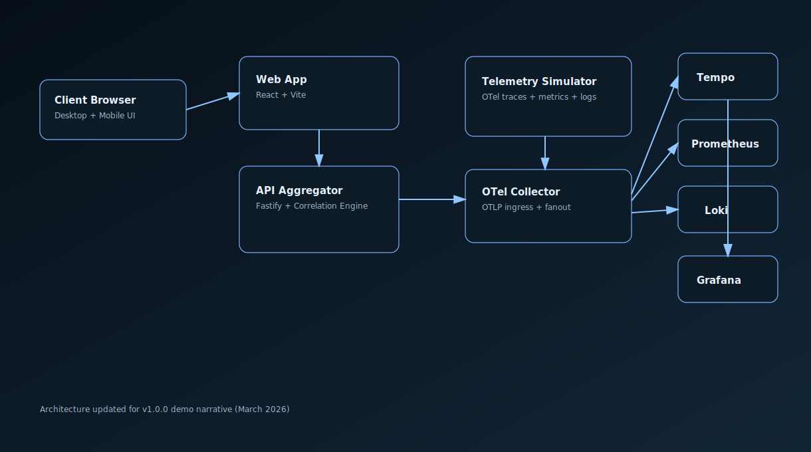

# Observability Command Center Demo

[](https://github.com/PierreDaguier/observability-command-center-demo/actions/workflows/ci.yml)
[](#quality)
[](https://github.com/PierreDaguier/observability-command-center-demo/releases)

Premium demo platform for client-facing observability storytelling, combining:
- Synthetic telemetry ingestion for realistic e-commerce/SaaS services
- KPI dashboards (availability, p95 latency, error budget)
- Logs-traces-metrics correlation via trace id
- Alert center with severity + incident timeline
- Incident replay mode with preloaded scenarios

## Stack
- Frontend: React + TypeScript + Vite + Recharts + Framer Motion
- Backend API: Fastify + TypeScript
- Telemetry simulation: Node + OpenTelemetry SDK (OTLP traces/metrics)
- Observability stack: OTel Collector + Prometheus + Grafana + Loki + Tempo
- Packaging: Docker Compose

## Visual Preview



## Quick Start

### Local dev
```bash
npm install
npm run seed
npm run dev
```

### Docker demo
```bash
npm install
npm run seed
npm run compose:up
```

Endpoints:
- Command Center UI: `http://localhost:4173`
- API health: `http://localhost:8080/health`
- Grafana: `http://localhost:3000` (`admin/admin`)
- Prometheus: `http://localhost:9090`

## Incident Replay
```bash
# Checkout lock storm
npm run demo:replay:checkout

# Auth token regression
npm run demo:replay:auth

# Stop replay
npm run demo:replay:stop
```

## Repository Structure
```text
apps/
  api/         Aggregation API, alerting, replay state, correlation engine
  simulator/   Synthetic telemetry generator + OTel emission
  web/         Client-facing command center UI
infra/
  otel-collector/
  prometheus/
  grafana/
  loki/
  promtail/
  tempo/
data/
  seed/        Service baseline and generated telemetry seed
  scenarios/   Incident replay definitions
docs/
  architecture/
  demo/
  governance/
```

## Demo Dataset and Scenarios
- Baseline services: `data/seed/services.json`
- Generated seed snapshot: `data/seed/telemetry-seed.json` (generated by `npm run seed`)
- Incident scenarios: `data/scenarios/incidents.json`
  - `checkout-lockstorm`
  - `auth-token-regression`

## Quality
- Lint: `npm run lint`
- Tests: `npm run test`
- Coverage: `npm run test:coverage`
- Build: `npm run build`

## GitHub Protocol
See:
- `SECURITY.md`
- `CONTRIBUTING.md`
- `docs/governance/github-protocol.md`
- `.github/pull_request_template.md`
- `.github/ISSUE_TEMPLATE/*`

## 7-Minute Client Walkthrough
`docs/demo/client-walkthrough-7min.md`

## Architecture Diagram
- Mermaid source: `docs/architecture/command-center-architecture.mmd`
- SVG export: `docs/architecture/command-center-architecture.svg`

## Notes
- For branch protection and milestones setup, run:
  - `scripts/setup-github-governance.sh <owner/repo>`
